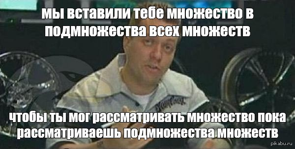

# 3. Полукольца, кольца, $\sigma$-кольца

## Содержание

* [Теория](#chapter1)
* [Задачи на пару](#chapter2)
* [Домашнее задание](#chapter3)
* [Гробы](#chapter4)

## Теория 

**Определение 1.** Система множеств $S$ называется **полукольцом**, если:

1) $\varnothing \in S$ (есть пустое множество, есть 0)

2) $\forall A \in S$, $\forall B \in S$ -> $A \cap B \in S$ (есть пересечение)

3) $\forall A \in S$, $\forall A_1 \in S$, $A_1 \subset A$ -> $\exists A_2, \ldots A_n \in S$ : $A_1 \sqcup A_2 \sqcup \ldots \sqcup A_n = A$ (есть разбиение)

**Определение 2.** Непустая система множеств R называется **кольцом**, если:

1. $\forall A \in R$, $\forall B \in R$ -> $A \cap B \in R$

2) $\forall A \in R$, $\forall B \in R$ -> $A \bigtriangleup B \in R$ (симметричная разность, все кроме пересечения)

**Определение 3.** Множество X называется единицей системы множеств T, если:

1) $X \in T$

2) $\forall A \in T$ верно $A \cap X = A$

Очевидно, такое название оправдывается ролью множества X при «умножении» (т. е. пересечении) множеств.

**Определение 4.** Кольцо множеств с единицей называется **алгеброй** множеств.

**Определение 5.** Система множеств R называется **$\sigma$-кольцом**, если:

1) $R$ — кольцо;

2) $\forall A_1,\ldots ,A_n, \ldots \in R$ -> $\bigcup_{i=1}^{\infty} A_i \in R$

(Просто перешли от дискретного к счетному)

**Определение 6.** $\sigma$-кольцо множеств с единицей называется **$\sigma$-алгеброй** множеств.

Пояснение к задачам:
* Отрезок - включает граничные точки $[a,b]$
* Интервал - не включает граничные точки $(a,b)$
* Полуинтервал - включает одну граничную точки $(a,b]$ или $[a,b)$ 
* Промежуток - все выше перечисленное

## Задачи на пару 

**1)** Докажите, что любое кольцо это полукольцо.

**2)** 
* Докажите, что множество всех подмножеств множества $\{1,2,3\}$ является алгеброй. Нарисуйте эту алгебру. Покажите, где здесь единица, а где ноль.
* Докажите, что для любого множества $A$, $2^A$ - алгебра.

**3)** Докажите, что множество всех **прямоугольников** на плоскости, со сторонами параллельными осям координат, является полукольцом без единицы, но не является кольцом. 

Верно ли это утверждение для отрезков, кубов и больших размерностей?

**4)** Докажите, что система всех интервалов на прямой не образует даже полукольца. 

В самом деле, полуинтервал $(0;2) - (0;1)=[1;2)$ нельзя разбить на конечное семейство непересекающихся интервалов.

**5)** Доказать,что σ-алгебра замкнута относительно операции счетного пересечения.

**6)** Доказать, что следующие множества являются полукольцами с единицей, и указать соответствующие единицы:
1) $\{[α; β) | a \leq α \leq β \leq b\}$ (включая пустой промежуток);
2) система всех промежутков, вложенных в отрезок $[a; b]$.

## Задачи на дом 

**1)** Пусть $X = \mathcal{N}$, $A = 2^{X}$. Является ли $A$ $\sigma$-алгеброй?

**2)** Пусть есть множество множеств $\{\{1,2,3\}, \{3,4,5\}, \{1,4,5\}\}$. Дополните эту систему до минимального полукольца, минимального кольца и минимальной алгебры. 

**3)** Докажите, что система всех промежутков на прямой (включая и бесконечные) образует только полукольцо с единицей. (Почему не кольцо?)

**4)** Докажите, что множество всех промежутков с рациональными концами, содержащихся в отрезке $[0; \pi]$ полукольцо. Почему не кольцо? Есть ли в нем единица?

**5)** Доказать, что:

* (0.5) пересечение произвольной непустой системы колец является кольцом (возможно, состоящим лишь из пустого множества);

* (0.25) пересечение произвольной непустой системы σ-колец является σ-кольцом;

* (0.25) пересечение непустой системы алгебр с одной и той же единицей является алгеброй.

## Гробы 

**1)(0.5)** Семейство всех ограниченных подмножеств прямой или плоскости образует кольцо, но не образует алгебры;

**2)(1)** Докажите, что множество всех прямоугольников на плоскости, со сторонами параллельными осям координат, **вписанных в окружность**, не образуют полукольцо.

**3)(1)**
* Пусть $S$ — полукольцо. Доказать, что система 
$$R = \big\{\bigcup_{i=1}^n A_i |A_i \in S\big\}$$ является кольцом.

**4)(1)**
* Пусть $S$ — полукольцо. Доказать, что система
$$R = \big\{\bigsqcup_{i=1}^n A_i |A_i \in S\big\}$$
совпадает с кольцом R, введенным в предыдущей задаче.

# Полезные ссылки
* [Конспект МГУ](http://math.phys.msu.ru/data/172/lec02a.pdf)
* [mathhelpnet](http://mathhelpplanet.com/static.php?p=polukoltsa-opredeleniye-aksiomy-primery)
